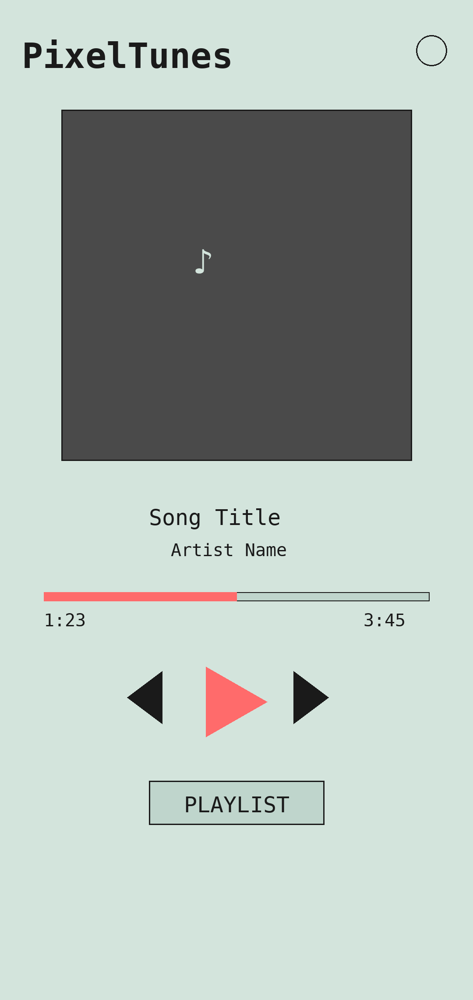
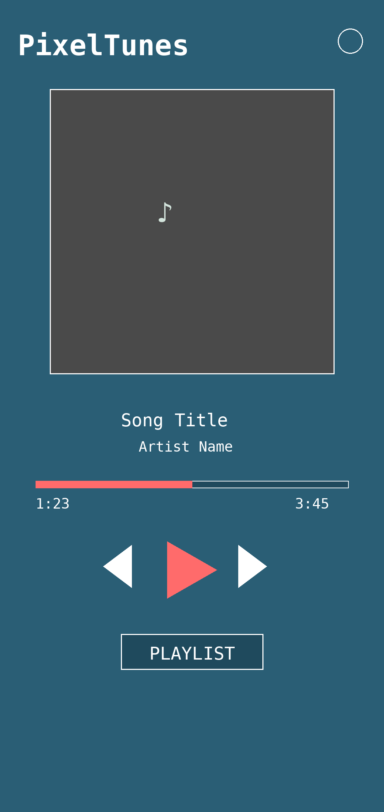
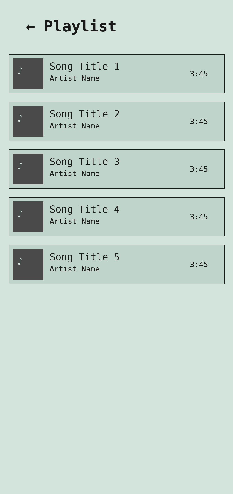
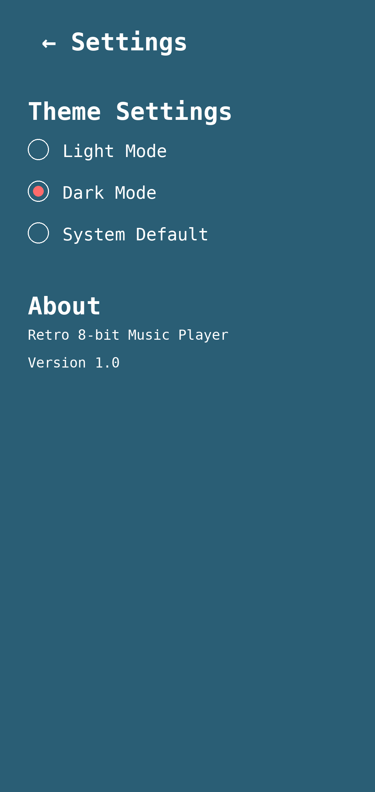

# PixelTunes Screenshots

Visual overview of the PixelTunes Android music player application.

## Main Screen - Light Mode

The main player interface in light mode featuring:
- **Background Color**: #D3E4DC (mint green)
- Album art display area
- Song title and artist information
- Playback progress bar with time indicators
- Play/Pause, Previous, and Next control buttons
- Playlist access button
- Settings button in top-right corner

## Main Screen - Dark Mode

The main player interface in dark mode featuring:
- **Background Color**: #2A5E75 (teal blue)
- Same layout as light mode with adjusted colors
- Better for low-light environments
- Maintains VT323 retro font throughout

## Playlist View

The playlist browser showing:
- List of all audio files from device storage
- Album art thumbnails for each song
- Song title, artist name, and duration
- Back button to return to main player
- Clean, scrollable list interface

## Settings Screen

The settings interface featuring:
- **Theme Selection**:
  - Light Mode (D3E4DC background)
  - Dark Mode (2A5E75 background)
  - System Default (follows device theme)
- Radio button controls for theme selection
- About section with app information
- Version number display

## UI Design Philosophy

### Retro 8-bit Aesthetic
- **Font**: VT323 monospace font throughout the entire app
- **Color Scheme**: Carefully chosen retro-inspired colors
- **Icons**: Simple geometric shapes reminiscent of classic pixel art
- **Layout**: Clean, functional design with clear visual hierarchy

### Skeumorphic Elements
- Card-based layout for playlist items
- Elevated album art display
- Button designs that suggest physical interaction
- Minimal but meaningful shadows and depth

### Accessibility
- High contrast text colors for readability
- Large, easily tappable control buttons
- Clear visual feedback for interactive elements
- Support for both light and dark viewing preferences

## Technical Implementation

The screenshots above are UI mockups representing the actual application interface built with:
- Android Material Components
- ConstraintLayout for responsive design
- RecyclerView for efficient playlist scrolling
- Glide for smooth image loading
- ExoPlayer for high-quality audio playback

## Color Reference

### Light Mode
- Background: `#D3E4DC`
- Surface: `#BFD5CC`
- Primary: `#2A5E75`
- Text: `#1A1A1A`

### Dark Mode
- Background: `#2A5E75`
- Surface: `#1F4A5D`
- Primary: `#D3E4DC`
- Text: `#FFFFFF`

### Accent Colors
- Accent: `#FF6B6B` (coral red)
- Secondary: `#4ECDC4` (cyan)
- Tertiary: `#FFE66D` (yellow)
